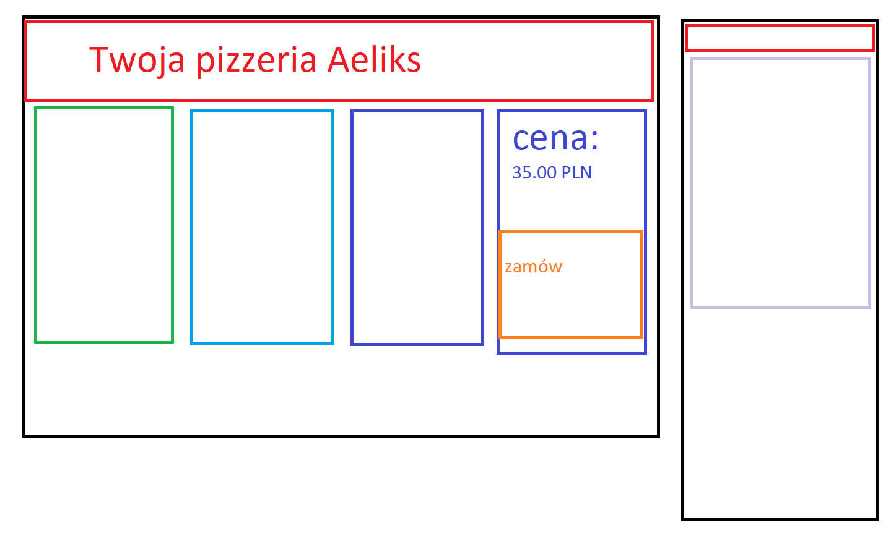

# Zadanie

Zaprojektować prosty interfejs aplikacji do zamawiania pizzy.

## Cechy interfejsu
- interfejs musi być responsywny, obsługiwać komputery stacjonarne i urządzenia mobilne (smartfony)
- interfejs musi mieć dwa warianty kolorystyczne

## Elementy interfejsu:
### Nazwa/logo pizzerii
### Opcje pizzy:
* rozmiar
 * mała
 * średnia
 * duża
* rodzaj ciasta:
  * cienkie
  * grube
* ciasto specjalne: bezglutenowe
* dodatki:
  * oliwki czarne
  * oliwki zielone
  * kiełbasa peperoni
  * ananas
  * szynka
  * ...
* dodatkowy ser
### Opcje dostawy:
* Adres
* telefon kontaktowy
### Opcje płatności
* gotówka / karta
### Przycisk zamów
### Cena `XX.XX PLN`

